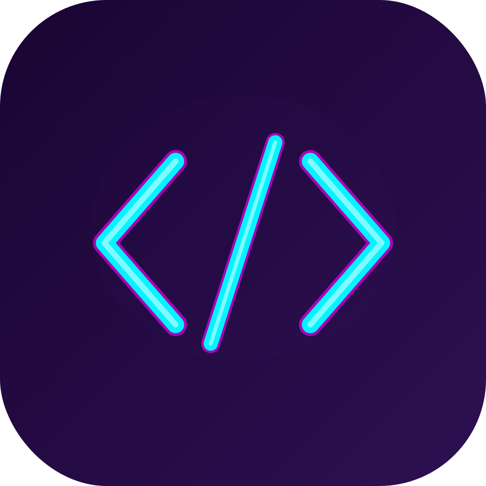

<p align="center">
  
</p>

<h1 align="center">Terrarium</h1>

<p align="center">
  <strong>A tiny terrarium to view your TSX components</strong>
  <br />
  A contained Tauri viewing environment where they can live and grow.
</p>

<p align="center">
  <a href="https://github.com/michellemayes/terrarium/releases"></a>
  <a href="https://github.com/michellemayes/terrarium/actions"></a>
  <a href="https://github.com/michellemayes/terrarium/blob/master/LICENSE"></a>
  
</p>

---

Claude generates beautiful TSX artifacts &mdash; interactive dashboards, data visualizations, mini-apps &mdash; but they live trapped inside a chat window. **Terrarium sets them free.**

Drop any `.tsx` file into Terrarium and it renders instantly as a standalone app. No `create-react-app`, no `package.json`, no setup. Terrarium reads the imports, installs the dependencies, bundles everything with esbuild, and shows you a live preview. Edit the file and it hot-reloads automatically.

## The Workflow

**Claude.ai &rarr; your file system &rarr; Terrarium**

1. **Generate** &mdash; Use Claude Desktop to build something as an Artifact. A dashboard, a form, a game, a chart &mdash; anything that renders as a React component.

2. **Export** &mdash; Click the download button on the Artifact to save it as a `.tsx` file, or copy the code into a new file.

3. **Preview** &mdash; Open the file in Terrarium. Double-click it, drag it onto the dock icon, or run `terrarium myfile.tsx` from your terminal.

4. **Iterate** &mdash; Edit the file in your editor or with [Claude Code](https://docs.anthropic.com/en/docs/claude-code) and watch Terrarium live-reload your changes. Go from chat prototype to polished local app without ever spinning up a dev server.

## Features

- **Open anywhere** &mdash; double-click, drag-and-drop, file picker, or CLI
- **Zero config** &mdash; auto-detects and installs npm dependencies from imports
- **Instant preview** &mdash; bundles with esbuild and renders the default export as a React component
- **Live reload** &mdash; watches for file changes and re-renders on save
- **Error overlay** &mdash; build errors appear in a collapsible banner while keeping the last good render visible
- **Tailwind built in** &mdash; Tailwind CSS available out of the box

## Install

Download the latest `.dmg` from [**Releases**](https://github.com/michellemayes/terrarium/releases).

### Requirements

- macOS 12+
- Node.js 18+

## Usage

```bash
# Open from the command line
terrarium myfile.tsx
```

Or launch the app and click **Open TSX File**, or drag a `.tsx` file onto the dock icon.

### Works great with Claude Code

Use Claude Code to iterate on your Artifacts without leaving the terminal. Terrarium watches the file and live-reloads every time Claude Code saves a change:

```bash
# In one terminal
terrarium dashboard.tsx

# In another terminal
claude "add a dark mode toggle to dashboard.tsx"
```

## Development

```bash
# Install dependencies
npm install
cd src-tauri/resources && npm install && cd ../..

# Run in dev mode
npm run tauri dev
```

## Testing

```bash
# Node.js tests (bundler + renderer)
npm test

# Rust tests
cd src-tauri && cargo test
```

## Built With

- [Tauri](https://tauri.app) &mdash; native app shell
- [esbuild](https://esbuild.github.io) &mdash; TSX bundling
- [React](https://react.dev) &mdash; component rendering
- [Tailwind CSS](https://tailwindcss.com) &mdash; styling

## License

[MIT](LICENSE)
